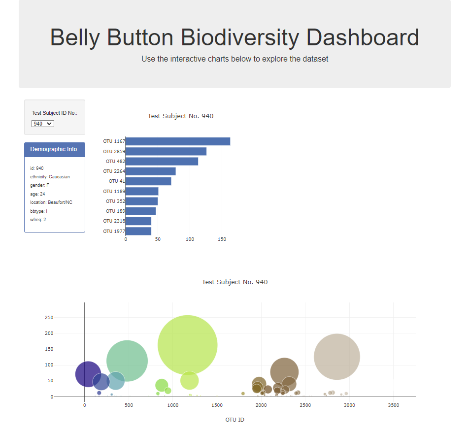
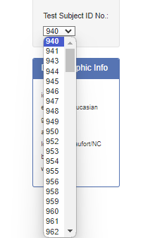
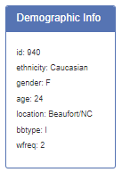
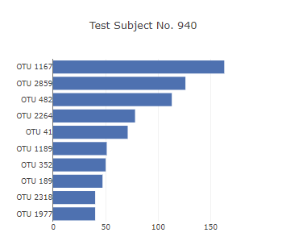
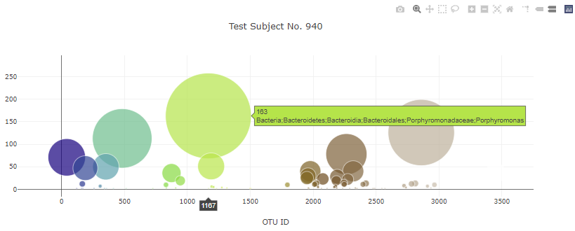

# Microbial Biodiversity using HTML and D3.js

**[Deploy Github Page](https://sallyca530.github.io/Belly-button-challenge/)**

## Introduction
This project delves into the realm of microbial diversity residing in human navels. By leveraging HTML, JavaScript, and D3.js, a presentation of an interactive dashboard that allows exploration of the belly button biodiversity dataset. This dataset sheds light on the prevalence of various microbial species among individuals, offering insights into the differing of microbial populations. Through horizontal bar charts, bubble charts, and metadata display, users can interactively engage with the data, gaining a deeper understanding of the microbial ecosystems thriving in human navels.

## Project Overview
### Retrieve data and confirm retrieval

    const url = 'https://2u-data-curriculum-team.s3.amazonaws.com/dataviz-classroom/v1.1/14-Interactive-Web-Visualizations/02-Homework/samples.json'
-
    const dataPromise = d3.json(url);
        console.log("Data Promise: ", dataPromise);

### Sample Metadata Display: 

Present demographic information by displaying key-value pairs from the metadata JSON object.

    function demoInfo(id) {
    d3.json(url).then(function (data) {
        // define variables 
        let sampleData = data;
        // get metadata
        let metadata = sampleData.metadata;
        // filter sample IDs
        let ID = metadata.filter(sample =>
            sample.id.toString() === id)[0];
        // display/panel info
        let demoPanel = d3.select('#sample-metadata');
        demoPanel.html('');
        // returns the each test subjects ID demographic info
        Object.entries(ID).forEach(([key, value]) => {
            demoPanel.append('h6').text(`${key}: ${value}`);
        })
    })
};

      

### Plot Creation

    function plotCreation(id) {
    d3.json(url).then(function (data) {
        // define variables
        let sampleData = data;
        // get samples data
        let samples = sampleData.samples;
        // filter each sample
        let ID = samples.filter(sample => sample.id === id);
        let filteredSample = ID[0];
        // call OTU ids/values
        let OTUvalues = filteredSample.sample_values.slice(0, 10).reverse();
        let OTUids = filteredSample.otu_ids.slice(0, 10).reverse();
        // add OTU labels 
        let labels = filteredSample.otu_labels.slice(0, 10).reverse();
        
        // Bar Chart Info
        // trace info - for selected id (test subject)
        let barTrace = {
            x: OTUvalues,
            y: OTUids.map(object => 'OTU ' + object),
            name: labels,
            type: 'bar',
            orientation: 'h'
        };
        // bar chart layout
        let barLayout = {
            title: `Test Subject No. ${id}`,
        };
        // bar chart plotting
        let barData = [barTrace];
        Plotly.newPlot('bar', barData, barLayout);
       
        // Bubble Chart info
        // trace info - for selected id (test subject)
        let bubbleTrace = {
            x: filteredSample.otu_ids,
            y: filteredSample.sample_values,
            mode: 'markers',
            marker: {
                size: filteredSample.sample_values,
                color: filteredSample.otu_ids,
                colorscale: 'Earth'
                },
            text: filteredSample.otu_labels,
        };
        // Bubble chart layout
        let bubbleLayout = {
            title: `Test Subject No. ${id}`,
            xaxis: { title: 'OTU ID' },
        };
        // Bubble chart plotting
        let bubbleData = [bubbleTrace];
        Plotly.newPlot('bubble', bubbleData, bubbleLayout);
    })
    };

**Bar Chart:** Creation of a horizontal bar chart showcasing the top 10 Operational Taxonomic Units (OTUs) found in an individual's navel. Utilize D3.js for data binding, with sample values as bar heights, OTU IDs as labels, and OTU labels as hover text.

**Bubble Chart:** Creation of a bubble chart illustrating each sample's microbial composition. Use OTU IDs for x-values, sample values for y-values and marker size, and OTU labels for text values. Marker colors are derived from OTU IDs.

### Interactive Dashboard 

Initialize dropdown and update all plots dynamically upon selection of a new sample. 

    function init() {
        let dropDown = d3.select('#selDataset');
        let id = dropDown.property('value');
        d3.json(url).then(function(data) {
            // define variables
            let sampleData = data;
            // get names data
            let names = sampleData.names;
            // get samples data
            let samples = sampleData.samples;
            Object.values(names).forEach(value => {
                dropDown.append('option').text(value);
            })
            // reflect on demographic info and plots
            demoInfo(names[0]);
            plotCreation(names[0])
        })
    };

Update sample

    function optionChanged(id) {
        plotCreation(id);
        demoInfo(id);
    };  

#### References

* **[Results are based off of belly button biodiversity dataset which catalogs the microbes that colonize human navels](https://robdunnlab.com/projects/belly-button-biodiversity/)**

* object.entries() - https://developer.mozilla.org/en-US/docs/Web/JavaScript/Reference/Global_Objects/Object/entries

* object.values() -https://developer.mozilla.org/en-US/docs/Web/JavaScript/Reference/Global_objects/Object/values